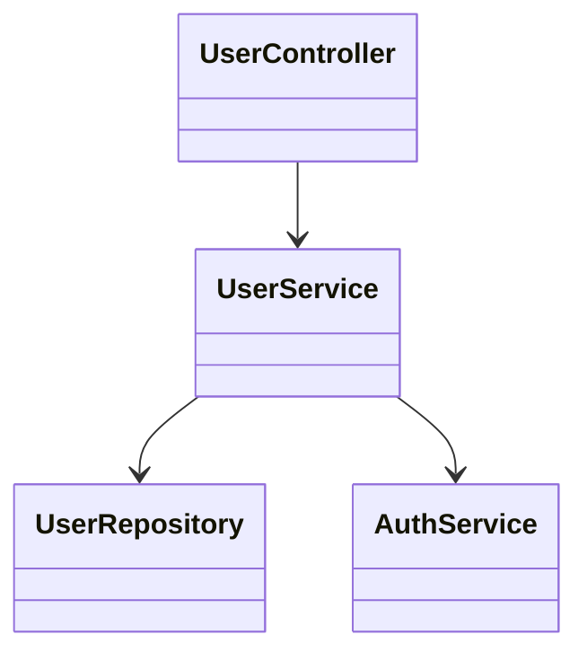
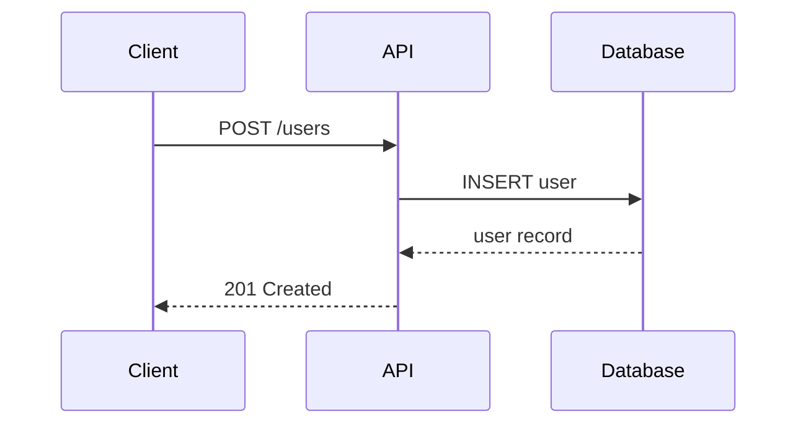

# review-pr

Analyze a GitHub pull request and provide:

1. A high-level explanation of what the PR does
2. The main changes and their purpose
3. Mermaid diagrams showing architecture and relationships
4. A suggested order to review the files to understand the flow

## Instructions

### Step 1: Determine what to analyze

**If a PR number is provided ($1):**
- Use `gh pr view $1 --json title,body,files` to fetch PR details
- Use `git fetch origin pull/$1/head:pr-$1` to fetch the PR branch

**If no PR number is provided:**
1. Get the current branch: `git branch --show-current`
2. Check if a PR exists for this branch: `gh pr view --json number,title,body,files`
   - If a PR exists, use it
   - If no PR exists, analyze the current branch as if it were a PR (see "Analyzing without a PR" below)

### Step 2: Gather change information

**Get repository info for links:**
- Use `gh repo view --json owner,name` to get owner and repo name
- Use `pwd` to get the local repository root path
- For PRs: get the PR number and branch from `gh pr view $1 --json number,headRefName`
- For current branch: use `git branch --show-current`

**For file links, gather:**
- PR number (for GitHub diff links)
- First changed line number per file: parse `git diff origin/main...HEAD` output - look for `@@ -X,Y +Z,W @@` hunks, the `+Z` is the starting line of changes
- GitHub diff anchor hash: compute SHA-256 of the file path using `echo -n "path/to/file.ts" | shasum -a 256 | cut -d' ' -f1`

**For existing PRs:**
- Use `git log origin/main..HEAD` (or `..pr-$1`) to see commits
- Use `git diff --name-only origin/main...HEAD` to list changed files

**Analyzing without a PR (current branch, no PR created yet):**
- Use `git log origin/main..HEAD` to see commits on this branch
- Use `git diff --name-only origin/main...HEAD` to list changed files
- Use `git diff origin/main...HEAD` to examine the actual changes
- Note in the output that this is a "Pre-PR Analysis" of uncommitted/unpushed work

### Step 3: Analyze and document

1. Examine key files to understand the flow (API specs, controllers, components)
2. Generate Mermaid diagrams to visualize the changes (see Diagrams section below)
3. Provide a concise summary organized as:
   - **High-level explanation**: What does this PR accomplish?
   - **Key changes**: What are the main modifications?
   - **Architecture diagrams**: Visual representation of relationships
   - **Suggested review order**: Group files logically (e.g., shared/API contracts → backend → frontend)

## Diagrams

Include Mermaid diagrams when they add clarity. Choose diagram types based on the nature of the changes:

**When to include diagrams:**
- New features with multiple components interacting
- Changes to data flow or API contracts
- Refactoring that affects module relationships
- Changes spanning multiple layers (frontend/backend/database)

**Skip diagrams for:**
- Single-file changes or simple bug fixes
- Documentation-only changes
- Trivial modifications where a diagram adds no value

**Diagram types to consider:**

| Change Type | Recommended Diagram |
|-------------|---------------------|
| API/data flow | `flowchart LR` or `sequenceDiagram` |
| Class/module relationships | `classDiagram` |
| State changes | `stateDiagram-v2` |
| Component hierarchy | `flowchart TD` |
| Database schema changes | `erDiagram` |

**Example diagrams:**

Data flow through new API endpoint:


Component relationships:


Request/response sequence:


## Output Format

Present the analysis with diagrams followed by the review order. Group files logically with brief annotations.

**IMPORTANT: Start every output with these links:**

1. A link to open the file in Cursor (for clickable IDE links)
2. A link to open the entire PR in github.dev (VS Code in browser)

```
> 📄 [Open in Cursor](cursor://file/Users/{username}/.claude/typora/pr-review-{pr_number}-{timestamp}.md) for clickable IDE links
> 🔗 [Open PR in github.dev](https://github.dev/{owner}/{repo}/pull/{pr_number}/files) for VS Code in browser
```

(The Cursor path will be shown after `/typora-markdown` saves the file - update the link accordingly)

**For existing PRs:**
```
> 📄 [Open in Cursor](cursor://file/...) for clickable IDE links
> 🔗 [Open PR in github.dev](https://github.dev/{owner}/{repo}/pull/{pr_number}/files) for VS Code in browser

## PR #123: Title of the PR

## High-Level Explanation
Brief description of PR purpose

## Architecture Overview

[Mermaid diagram showing how components interact]

## Key Changes
- Change 1
- Change 2

## Suggested File Review Order

**IMPORTANT: Use a numbered list (not a table) with this exact format for each file:**

```
N. `relative/path/to/file.ts` - Brief description of what this file does/changes
   [GH](github-pr-diff-link) | [IDE](cursor-file-link)
```

**Link types:**
- **[GH]** - Opens the file's diff on GitHub
- **[IDE]** - Opens the file at the first changed line in Cursor

**Constructing the links:**

1. **GitHub PR diff link:**
   ```
   https://github.com/{owner}/{repo}/pull/{pr_number}/files#diff-{sha256_hash}
   ```
   Get hash: `echo -n "path/to/file.ts" | shasum -a 256 | cut -d' ' -f1`

2. **Cursor file link:**
   ```
   cursor://file/{repo_root}/{filepath}:{first_changed_line}
   ```

**Example with real values** (owner=acme, repo=webapp, pr_number=123, repo_root=/Users/dev/webapp):

### 1️⃣ API Contracts (Shared)
1. `src/api/auth.types.ts` - Defines authentication request/response types
   [GH](https://github.com/acme/webapp/pull/123/files#diff-8b5a5d4e8f...) | [IDE](cursor://file/Users/dev/webapp/src/api/auth.types.ts:15)

2. `src/api/user.types.ts` - Adds user profile types
   [GH](https://github.com/acme/webapp/pull/123/files#diff-abc123...) | [IDE](cursor://file/Users/dev/webapp/src/api/user.types.ts:8)

### 2️⃣ Backend Implementation
3. `src/services/auth.service.ts` - Core authentication logic
   [GH](https://github.com/acme/webapp/pull/123/files#diff-def456...) | [IDE](cursor://file/Users/dev/webapp/src/services/auth.service.ts:42)
```

**For pre-PR analysis** (no PR exists yet), use blob links for GH since there's no PR:
```
> 📄 [Open in Cursor](cursor://file/...) for clickable IDE links

> ℹ️ **Pre-PR Analysis** - No PR exists yet for branch `{branch-name}`. This analysis shows what a PR would contain.

[GH](https://github.com/{owner}/{repo}/blob/{branch}/{filepath}) | [IDE](cursor://file/{repo_root}/{filepath}:{line})
```

**Link construction summary:**
- `{owner}` and `{repo}`: from `gh repo view --json owner,name`
- `{pr_number}`: from `gh pr view --json number`
- `{sha256_hash}`: `echo -n "{filepath}" | shasum -a 256 | cut -d' ' -f1`
- `{first_changed_line}`: from diff hunk headers `@@ -X,Y +Z,W @@` - use the `Z` value
- `{repo_root}`: from `pwd`

Focus on creating a logical learning path through the changes, not just listing files alphabetically. Use diagrams to show the "big picture" before diving into file details.

## Final Step

After generating the analysis, invoke the `/typora-markdown` skill to open the output in Typora for enhanced viewing of the diagrams and formatted content.
