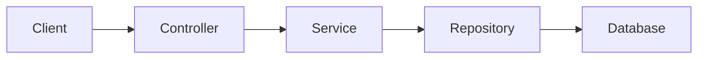
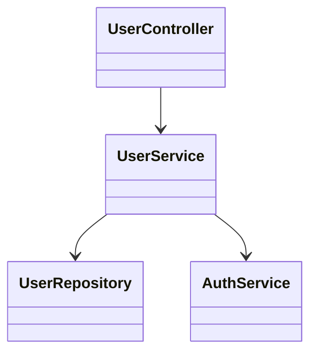
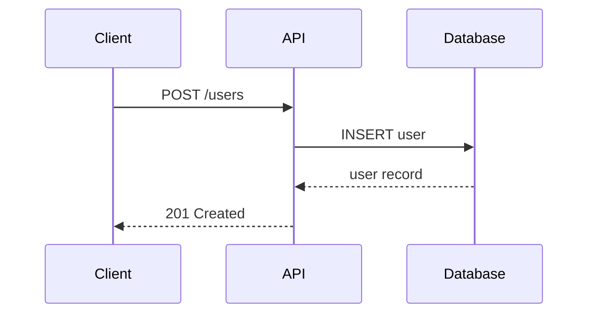

# review-pr

Analyze GitHub pull request $1 and provide:

1. A high-level explanation of what the PR does
2. The main changes and their purpose
3. Mermaid diagrams showing architecture and relationships
4. A suggested order to review the files to understand the flow

## Instructions

1. Use `gh pr view $1 --json title,body,files` to fetch PR details
2. Use `git fetch origin pull/$1/head:pr-$1` to fetch the PR branch
3. Use `git log origin/main..pr-$1` to see commits
4. Use `git diff --name-only origin/main...pr-$1` to list changed files
5. Examine key files to understand the flow (API specs, controllers, components)
6. Generate Mermaid diagrams to visualize the changes (see Diagrams section below)
7. Provide a concise summary organized as:
   - **High-level explanation**: What does this PR accomplish?
   - **Key changes**: What are the main modifications?
   - **Architecture diagrams**: Visual representation of relationships
   - **Suggested review order**: Group files logically (e.g., shared/API contracts → backend → frontend)

## Diagrams

Include Mermaid diagrams when they add clarity. Choose diagram types based on the nature of the changes:

**When to include diagrams:**
- New features with multiple components interacting
- Changes to data flow or API contracts
- Refactoring that affects module relationships
- Changes spanning multiple layers (frontend/backend/database)

**Skip diagrams for:**
- Single-file changes or simple bug fixes
- Documentation-only changes
- Trivial modifications where a diagram adds no value

**Diagram types to consider:**

| Change Type | Recommended Diagram |
|-------------|---------------------|
| API/data flow | `flowchart LR` or `sequenceDiagram` |
| Class/module relationships | `classDiagram` |
| State changes | `stateDiagram-v2` |
| Component hierarchy | `flowchart TD` |
| Database schema changes | `erDiagram` |

**Example diagrams:**

Data flow through new API endpoint:


Component relationships:


Request/response sequence:


## Output Format

Present the analysis with diagrams followed by the review order. Group files logically with brief annotations.

Example structure:
```
## High-Level Explanation
Brief description of PR purpose

## Architecture Overview

[Mermaid diagram showing how components interact]

## Key Changes
- Change 1
- Change 2

## Suggested File Review Order

### 1️⃣ API Contracts (Shared)
1. path/to/api/spec.ts - What it defines
2. path/to/another/spec.ts - What it defines

### 2️⃣ Backend Implementation
3. path/to/controller.ts - What it does
4. path/to/service.ts - What it does

### 3️⃣ Frontend Components
5. path/to/component.tsx - What it does
```

Focus on creating a logical learning path through the changes, not just listing files alphabetically. Use diagrams to show the "big picture" before diving into file details.
